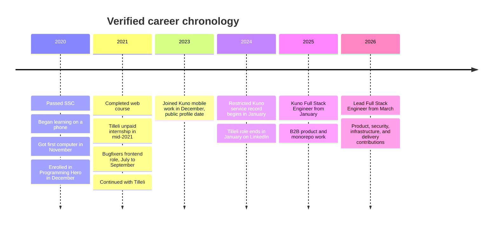

# Career history

## Dated roles and transitions

| Period               | Organization | Role                         | Status and notes                                                                                                 |
| -------------------- | ------------ | ---------------------------- | ---------------------------------------------------------------------------------------------------------------- |
| Mar 2026 to present  | Kuno         | Lead Full Stack Engineer     | Current LinkedIn and portfolio title. "Present" means verified on 2026-09-03.                                    |
| Jan 2025 to Mar 2026 | Kuno         | Full Stack Engineer          | LinkedIn role record. Restricted evidence supports work across the B2B platform, services, data, and interfaces. |
| Dec 2023 to Jan 2025 | Kuno         | Mobile Application Developer | LinkedIn role record for a language-learning app.                                                                |
| Jan 2024 onward      | KUNO SAS     | Full Stack Engineer services | Restricted business record. This overlaps the public mobile title and uses a broader service label.              |
| Jun 2021 to Jan 2024 | Tilleli Inc. | React Native Developer       | LinkedIn lists this as full-time. The internship-to-paid conversion date remains unresolved.                     |
| Mid-2021             | Tilleli Inc. | Unpaid React Native intern   | Restricted internship agreement. It describes an educational internship and no employment guarantee.             |
| Jul 2021 to Sep 2021 | Bugfixers    | Frontend Developer           | LinkedIn. Work centered on the Future Track Learning web application.                                            |

## Pre-career learning

- 2020: passed SSC from a small school, by self-report.
- November 2020: began using his first computer and chose web development.
- December 2020: enrolled in Programming Hero's six-month web-development course.
- January to April 2021: the restricted 2021 resume lists the Programming Hero course in this period. LinkedIn records the certificate in April 2021.
- June 2021: LinkedIn records the Zero To Mastery React Native certificate.

## Overlaps and conflicts

- A Tilleli client recommendation says work began in May 2021. LinkedIn says June 2021. A restricted agreement begins later in June.
- Tilleli and Bugfixers overlap from July to September 2021. The personal story says Sohel pursued paid work while the Tilleli internship was unpaid.
- Tilleli and Kuno overlap in December 2023 and January 2024. Treat this as a transition unless a formal end date proves otherwise.
- The public Kuno role begins in December 2023. A restricted business record uses January 2024. Preserve both at month level.
- Programming Hero's 2025 Facebook headline says Senior Software Engineer. The story body and LinkedIn role say Full Stack Engineer. The current Lead title begins in March 2026.
